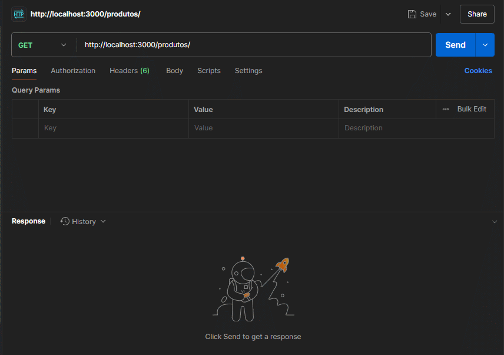
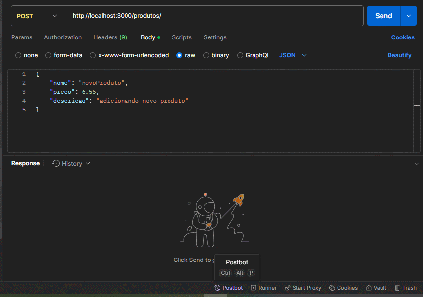
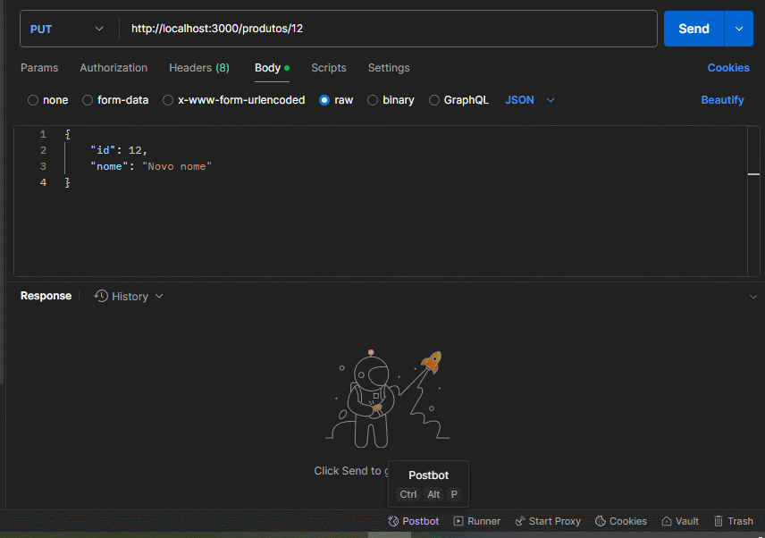
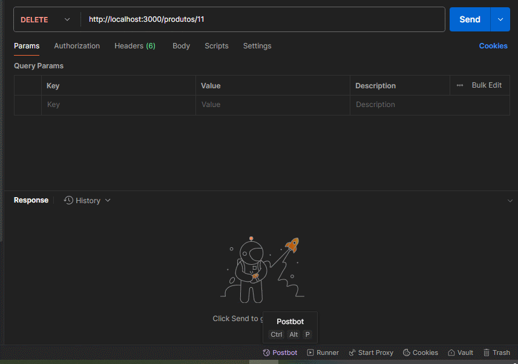

# Teste Técnico AG Sistemas - Exercicio 1
## Autor: Luan Fellipe (allen08)

### Descrição:
Exercício 1: Criação de um CRUD Básico com Node.js e Banco de Dados SQL.
 

### Instruções para execução:
  - Ter um banco de dados criado em MySQL e rodando
  - Configurar as informações de database (padrão: testetecnicoagsistemas), username e password em src/app.module.ts.
  - rodar comando: **npm run start:dev**

## Execução das rotas necessárias

### [*] GET request: listando todos os produtos

### [*] POST request: adicionando um produto

### [*] GET request: listar um produto específico

### [*] PUT request: atualizar um produto

### [*] DELETE request: deletando um produto

