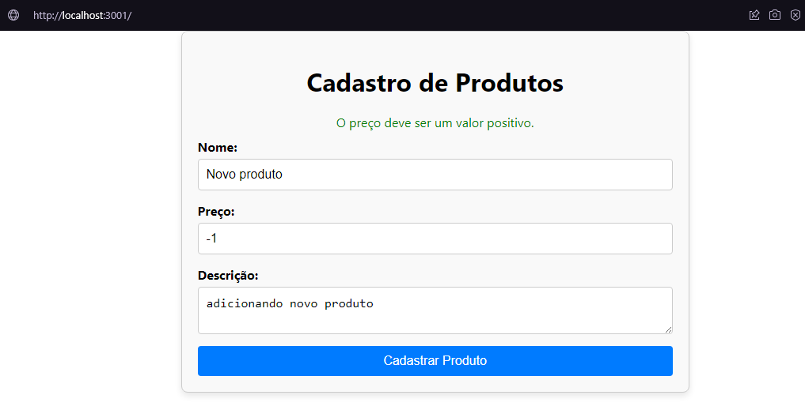
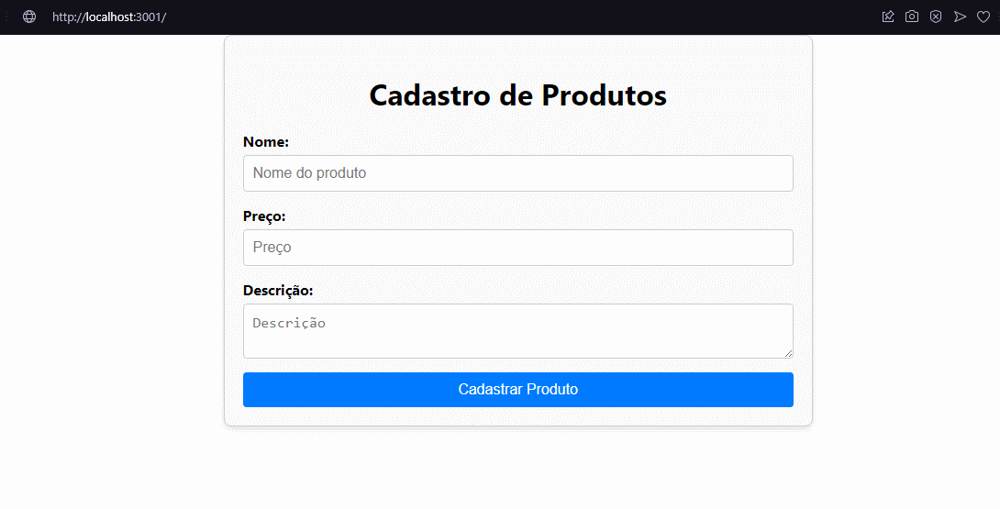
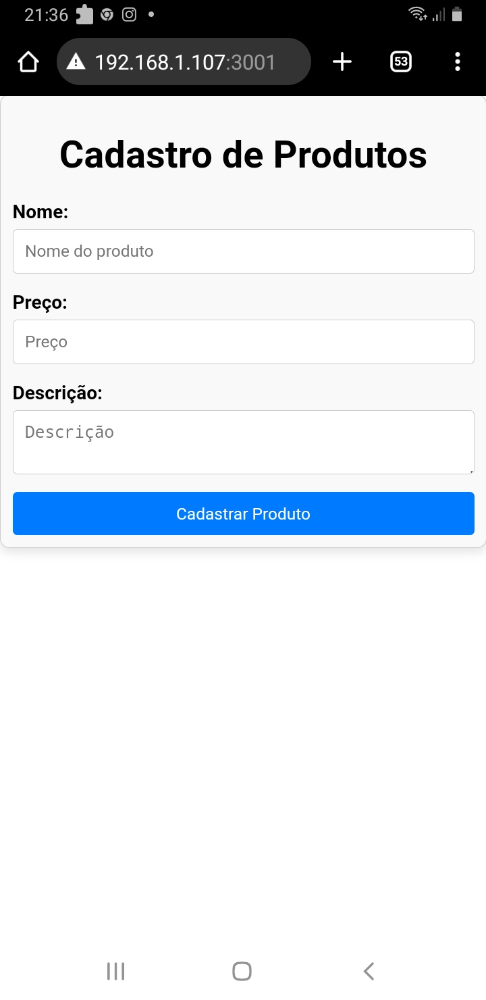

# Teste Técnico AG Sistemas - Exercicio 2
## Autor: Luan Fellipe (allen08)

### Descrição:
Execício 2: Criação de uma Interface Gráfica para um CRUD Básico em React no
formato de formulário.
 

### Instruções para execução:
  - Estar com a API do exercicio1 rodando na porta 3000
  - instalar as dependências (exercicio2/crud-produtos): **npm install** 
  - rodar o app: **npm start** (abrirá na porta 3001)

## Execução das rotas necessárias

### [*] Exemplo de valor do preço inválido

### [*] Cadastrando novo produto

### [*] Exibindo responsividade (executando no celular Samsung Galaxy J7)

