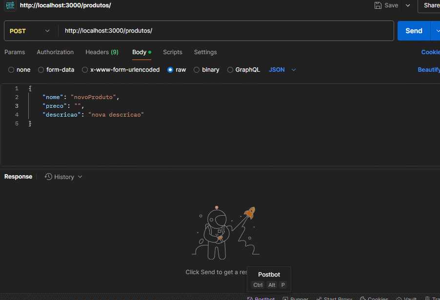
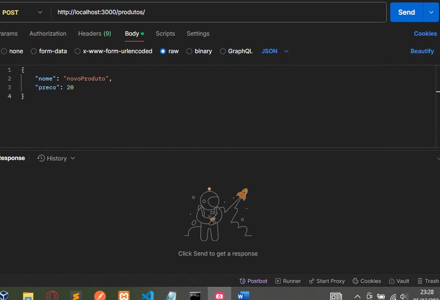
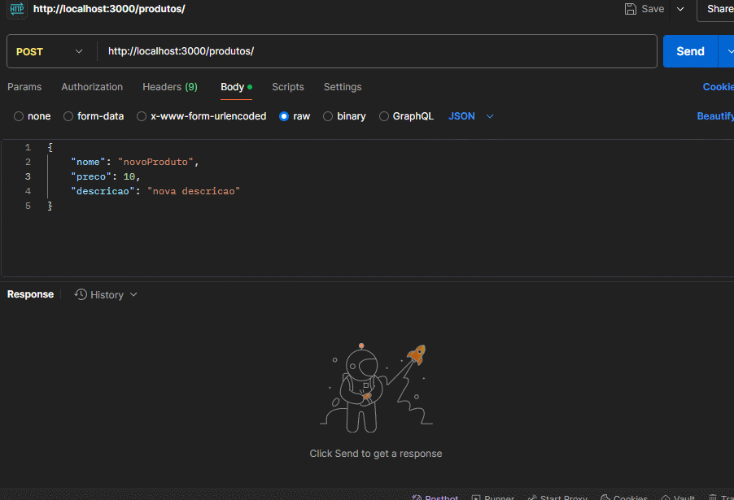
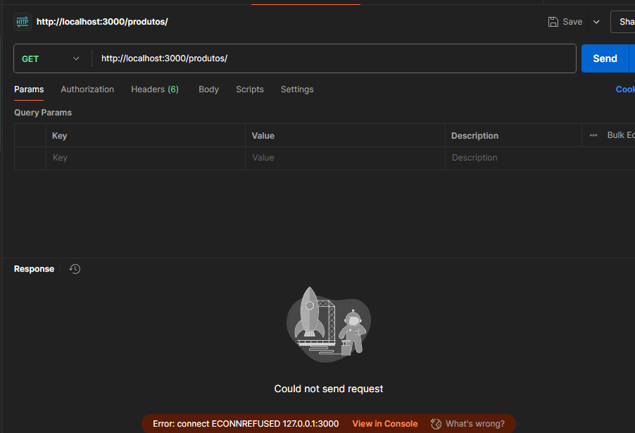

# Teste Técnico AG Sistemas - Exercicio 4
## Autor: Luan Fellipe (allen08)

### Descrição:
Execício 4: Integração entre Camadas de Serviço e Banco de Dados com Node.js 
 

### Instruções para execução:
  - Ter um banco de dados criado em MySQL e rodando.
  - Configurar as informações de database (padrão: testetecnicoagsistemas), username e password em src/app.module.ts.
  - instalar as dependências (exercicio4/crud-produtos): **npm install** 
  - rodar o app: **npm run start:dev**

## Execução

### [*] POST request: Exemplo de requisição com preço inválido

### [*] POST request: Exemplo de requisição sem descrição

### [*] POST request: Exemplo de requisição válida

### [*] GET request: Listando os produtos

